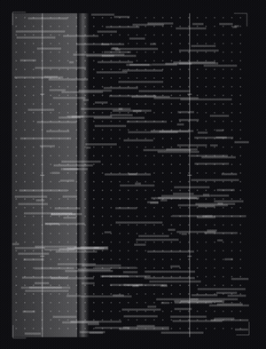
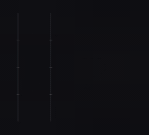
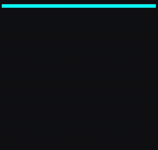

# Neuron HUD 🛰️

[](https://github.com/sudo-poporin/neuron-hud/actions/workflows/test.yml)
[](https://github.com/sudo-poporin/neuron-hud/actions/workflows/test.yml)
[](https://pub.dev/packages/very_good_analysis)
[](https://flutter.dev)
[](LICENSE)

Sistema de carga y revelado por capas para Flutter, con el lenguaje visual de un
HUD holográfico: ruido en bloques, matrices de puntos, marcos en L, líneas guía,
aberración cromática y bandas desplazadas.

## Características ✨

- 🧩 **Cinco familias de piezas** que se combinan **anidándolas**: no hay un widget con banderas ni un enum de efectos
- 🪶 **Cero dependencias de terceros**: sólo `flutter`
- ♿ **Fallback de «reducir movimiento» en todas las piezas**, sin controller y sin timers
- 🎲 **Azar determinista**: cada efecto deriva su patrón de una semilla que entra por parámetro
- 🧠 **Registro de revelados** para que un `Hero` en vuelo o un `ListView` reciclando filas no re-disparen lo que ya corrió
- 🎛️ **Colores y tipografía por parámetro**, porque un package no puede leer el tema de su consumidor
- ✅ **356 tests y 100 % de cobertura**

## En movimiento 🎬

Las cinco capturas salen del ejemplo de [`example/`](example), que es la misma
app que levanta `flutter run`. Son GIFs y no fotos: lo que hay que ver es el
**orden y el ritmo**, y una imagen fija de un campo de ruido es un cuadro de
ruido.

### Ausente — contenido que todavía no resolvió



Las capas apiladas y tres relojes externos que las mueven, cada uno a su escala:
el ruido varias veces por segundo, el barrido cada tres, las guías cada cuatro.
No termina nunca.

### Entrada — un revelado, que empieza y termina



Las siete fases en orden sobre una figura. Después del pico de aberración llegan
las bandas horizontales corridas, que son la estabilización.


El mismo revelado **sin `slice`** sobre un texto. El slicing es adorno de
estabilización y viene *después* de que el contenido ya se leyó: encima de un
mensaje lo vuelve ilegible justo mientras alguien lo está leyendo.

### En curso — algo está pasando ahora


Una pieza de ritmo sola, sin orquestador. Lo que comunica «esto está pasando» es
que sea **continuo**: una ráfaga cada tres segundos comunica inestabilidad, no
progreso.

### Escalonado — los hermanos no entran juntos



`Stagger` publica el retraso y `ExpandLine` lo lee. Cada fila espera su turno y
después se abre desde una línea: primero la línea, una pausa, y recién ahí el
alto.

## Instalación 💻

Se consume por tag de git.

```yaml
dependencies:
  neuron_hud:
    git:
      url: https://github.com/sudo-poporin/neuron-hud
      ref: v1.0.0
```

```dart
import 'package:neuron_hud/neuron_hud.dart';
```

`lib/neuron_hud.dart` es el único punto de entrada. Nada de `lib/src/` se importa
por su path.

## El revelado 🎞️

`NeuronReveal` es el orquestador: corre las siete fases en orden sobre su hijo y
les mueve el `progress` a las capas.

```dart
NeuronReveal(
  ready: cover != null,
  seed: item.id,
  ink: Colors.white,
  fastPathAfter: const Duration(milliseconds: 80),
  child: cover ?? const SizedBox.shrink(),
)
```

Con `ready: false` la **formación** corre igual y el revelado se detiene donde
empieza la **resolución**, con el andamio puesto y el contenido oculto. Cuando
pasa a `true`, sigue.

Las siete fases, en orden, con su duración por defecto:

| Fase | Qué pinta | Default |
| --- | --- | --- |
| `guides` | Las líneas guía, que son andamio y llegan primero | 120 ms |
| `dots` | El campo de matriz de puntos | 100 ms |
| `noise` | El cúmulo de ruido en bloques | 120 ms |
| `condense` | El ruido condensándose en la forma, y el contenido apareciendo | 180 ms |
| `chromatic` | El pico de aberración cromática. Una sola vez | 120 ms |
| `slice` | Las bandas horizontales desplazadas. Posterior al pico, no simultáneo | 90 ms |
| `settle` | La estabilización | 120 ms |

Las siete suman 850 ms. `phases` dice **cuáles** corren, no en qué orden: el
orden es siempre el de `NeuronPhase.values`. Un revelado de texto sin `slice`
suma 760 ms. Con la lista vacía se pinta el hijo pelado.

`durations` sobreescribe una fase o varias sin tocar el resto.

## El vocabulario 🧩

Cinco familias. Se combinan **anidándolas**: no hay un widget con banderas ni un
enum de efectos.

### Capas 🧱

`CustomPainter` sin reloj propio. Aceptan un `progress` externo opcional y sin él
son estáticas.

| Pieza | Qué pinta |
| --- | --- |
| `BlockNoise` | El campo de barras que se recalcula. El efecto firma del sistema |
| `DotMatrix` | La retícula de puntos del fondo |
| `TechFrame` | El marco en L de las cuatro esquinas |
| `GuideLines` | Las líneas de andamio, que pueden desbordar la caja |

**`progress` va al revés de lo que parece.** En 0 la capa se pinta **completa** y
en 1 no se pinta nada. Una capa entra llevando su `progress` de 1 a 0 y sale
llevándolo de 0 a 1. Es la inversa de casi cualquier painter de progreso, así que
invertirlo no da error: da un efecto que corre al revés y se ve casi bien.

### Ritmo 🫀

Tienen reloj propio y sirven sueltas, en bucle.

| Pieza | Qué hace |
| --- | --- |
| `ChromaticBurst` | El pico de aberración cromática, en ráfagas |
| `SlicedBox` | Las bandas horizontales desplazadas |
| `NoiseSweep` | El barrido que atraviesa la caja, con estela |
| `TerminalCursor` | El cursor que parpadea al final de un texto |

### Entrada 🚪

| Pieza | Qué hace |
| --- | --- |
| `ExpandLine` | La apertura desde una línea |
| `Stagger` | El escalonado de la entrada entre hermanos |

`Stagger` coordina el desfase de entrada, nunca el reloj de cada efecto.

### Modificador 🔀

`Perspective` desfasa las partes de su hijo con sombra. **No** es un `Matrix4`
sobre el hijo entero.

### Orquestador 🎼

`NeuronReveal`, arriba.

## El registro de revelados 🧠

Evita que un `Hero` en vuelo o un `ListView.builder` reciclando filas re-disparen
un revelado que ya corrió.

```dart
final owner = neuronRowOwner('lista', item.id);
final key = neuronRevealKey(owner, 'portada');

return NeuronRevealMemory(
  owner: owner,
  child: NeuronReveal(
    alreadyRevealed: neuronAlreadyRevealed(key),
    onRevealStart: () => markNeuronRevealed(key),
    child: child,
  ),
);
```

`onRevealStart` se dispara en el frame en que el revelado **arranca**, no al
terminarlo: cuando un `Hero` vuela, Flutter reconstruye el hijo para el overlay y
ese `NeuronReveal` nuevo arranca en cero. Consultando el registro, la
reconstrucción ve el id y pinta el final.

**Corre en fase de build, así que no puede llamar `setState`.**

El registro es estado de librería. Si montás estos widgets en tus tests, vacialo
entre uno y otro desde tu propio `flutter_test_config.dart`, o las suites fallan
por orden de ejecución:

```dart
void testExecutable(FutureOr<void> Function() testMain) async {
  setUp(resetNeuronRegistry);
  await testMain();
}
```

Ese es el motivo por el que `resetNeuronRegistry` se exporta a pesar de llevar
`@visibleForTesting`.

## Colores y tipografía 🎨

**Un package no puede leer el tema de su consumidor**, así que los colores entran
por parámetro y hay un default `const` para cada uno: `astralInk`,
`astralInkDim`, `astralInkFaint` para las capas, `astralChromaticA` y
`astralChromaticB` para el pico.

Los defaults son blanco sobre fondo oscuro, que es el de la referencia. **Sobre
un fondo claro no se ven**: pasá la tinta que tu fondo pida.

Lo mismo con la tipografía. `TerminalCursor` hereda el `DefaultTextStyle` del
entorno si no le pasás uno.

## Reducir movimiento ♿

Con `MediaQuery.disableAnimations` los efectos quedan estáticos, sin controller y
sin timers.

**No es opcional y no es una optimización.** Aberración cromática más parpadeo
rápido es un patrón fotosensible.

## Azar determinista 🎲

Todos los efectos usan azar en runtime, y todos lo derivan de una semilla que
entra por parámetro. Derivarla del item —`seed: item.id`— le da a cada fila su
propio patrón, y hace que los tests sean deterministas.

La semilla también desfasa los relojes: veinte cajas montadas en el mismo frame y
con el mismo período laten juntas, y eso lee como parpadeo y no como carga.

## Referencias 📚

El lenguaje visual sale de dos notas del blog oficial de PlatinumGames sobre el
diseño de la UI de *Astral Chain*, y de los videos que las acompañan. Cada pieza
de este package apunta a una de las dos:

| Nota | De dónde sale |
| --- | --- |
| 📘 [The Wide World of UI, Part I](https://www.platinumgames.com/official-blog/article/10397) | El diagrama de descomposición del HUD y la animación de sus capas |
| 📗 [The Wide World of UI, Part II](https://www.platinumgames.com/official-blog/article/10422) | La apertura de los paneles del menú y el estudio de ángulo y desfase |

Qué salió de cada video, para que se pueda contrastar con la fuente:

| Video | Nota | Piezas |
| --- | --- | --- |
| `logo_animation.mp4` | I | `ChromaticBurst` —cian a la izquierda, rojo a la derecha— y `SlicedBox`, cuyas bandas llegan **después** del pico y no a la vez |
| `hud_inanimation.mp4` | I | Las cuatro capas y el orden en que se forman: `GuideLines` primero, después `DotMatrix` y `BlockNoise` |
| `menu_noize.mp4` | I | `NoiseSweep` en sus dos intensidades, y el `TerminalCursor` de los headers `MAP_`, `ITEM_` y `LEGION_` |
| `menu_open.mp4` | II | `ExpandLine`: los paneles no aparecen, se **abren** desde una línea brillante |
| `036_UIblog_onishi_01.mp4` y `_02.mp4` | II | `Perspective`, del estudio 【角度・ズレ調整】 —«ajuste de ángulo y desfase»— |

El par de colores por defecto de la aberración —`astralChromaticA` y
`astralChromaticB`— sale del frame del pico de `logo_animation.mp4`. Son un
default, no una imposición: el color entra por parámetro.

## Atribución 📎

El lenguaje visual de este package es una **lectura** del HUD de *Astral Chain*
(PlatinumGames, 2019), a partir de las dos notas de arriba. No hay assets, código
ni material del juego en este repositorio: lo que hay son piezas escritas desde
cero mirando esos videos.

Es un trabajo derivado e independiente. Este proyecto **no está afiliado a
Nintendo ni a PlatinumGames**, ni cuenta con su respaldo. *Astral Chain* es marca
de sus respectivos titulares.

## Licencia 📄

MIT. Ver [LICENSE](LICENSE).
